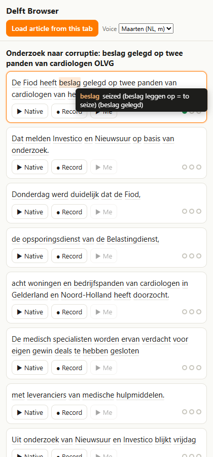
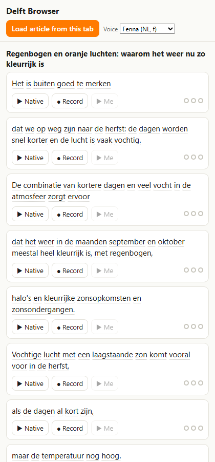

```
 ____       _  __ _     ____
|  _ \  ___| |/ _| |_  | __ ) _ __ _____      _____  ___ _ __
| | | |/ _ \ | |_| __| |  _ \| '__/ _ \ \ /\ / / __|/ _ \ '__|
| |_| |  __/ | _|  |_  | |_) | | | (_) \ V  V /\__ \  __/ |
|____/ \___|_|_|  \__| |____/|_|  \___/ \_/\_/ |___/\___|_|

        luister  ·  spreek  ·  luister terug  ·  ×3
```

**Learn Dutch the Delft way on any web page.** Open a Dutch news article, click the extension, and the side panel turns it into short phrases you can practise one at a time, the way the Delft method textbooks do:

1. **▶ Native** plays the phrase in a natural Dutch voice
2. **● Record** records you saying it
3. **▶ Me** plays your take back so you can compare

Three full rounds fill the dots. Hover any word for its English meaning, click it to hear it on its own. The **Speed** picker is a CEFR level: B2 is the voice at its natural pace, A1 is 30% slower, C2 is 20% faster.

No account. No API keys. No server. Everything runs inside Chrome.

<p align="center">
  
  &nbsp;&nbsp;
  
</p>

## Install

**1. Download** the latest `delft-browser-<version>.zip` from [Releases](https://github.com/teamgonuts/delft-browser/releases) and unzip it somewhere you'll keep it (Chrome loads the extension from that folder).

**2. Load it in Chrome**

- Open `chrome://extensions`
- Turn on **Developer mode** (toggle, top right)
- Click **Load unpacked** and pick the unzipped folder
- Click the puzzle-piece icon in the toolbar and pin **Delft Browser**

**3. Use it**

- Open a Dutch article (nos.nl, nu.nl, parool.nl, volkskrant.nl…)
- Click the Delft Browser icon. The panel loads the article by itself and follows you as you switch tabs or open the next article. The ↻ button reloads the current page.
- The first time you press **Record**, a tab opens asking for microphone access. Allow it once.

Needs Chrome 138 or newer. On the first hover Chrome downloads its Dutch→English translation model once (a few seconds); after that hovers are instant and offline.

## What's under the hood

| Piece | How |
|---|---|
| Article extraction | Mozilla Readability in a content script |
| Phrase splitting | Deterministic rules (`extension/lib/splitter.js`): sentences up to 13 words stay whole, longer ones cut at commas and colons, then before *dat / die / zodra…*, then before a preposition. Fitted to a set of hand-approved splits, see `test/splitter.test.mjs`. |
| Native voice | Microsoft Edge "Read Aloud" neural voices (Maarten, Fenna, Colette, Dena), called over WebSocket straight from the extension (`extension/lib/edgetts.js`). Every phrase preloads when the article loads and is cached in IndexedDB, so playback is instant. Falls back to Chrome's built-in Dutch voice if the endpoint is unreachable. |
| Word glosses | A bundled mini-dictionary of function words, pronoun-adverbs and separable verbs (`extension/lib/dictionary.js`), then Chrome's on-device Translator API (`extension/lib/glosses.js`). |
| Recording | MediaRecorder in the side panel. Recordings stay in memory, nothing leaves your machine. |

## Development

```bash
node test/splitter.test.mjs        # phrase splitter against the approved splits
cd test && npm install && cd ..
node test/e2e.mjs [articleUrl]     # loads the extension into a throw-away Chrome and runs the full loop
node build.mjs                     # dist/delft-browser-<version>.zip
```

`helper/` is the Milestone 1 proof-of-concept server (Claude-generated glosses). The extension no longer uses it; it is kept for comparing gloss quality.

Plans, results and decisions live in the project wiki, see [NOTES.md](NOTES.md).

## Credits

Voice protocol ported from [rany2/edge-tts](https://github.com/rany2/edge-tts) (MIT). Article extraction by [mozilla/readability](https://github.com/mozilla/readability) (Apache 2.0). The Delft method is the work of the TU Delft language centre; this project just brings its listen-speak-compare loop to the open web.
